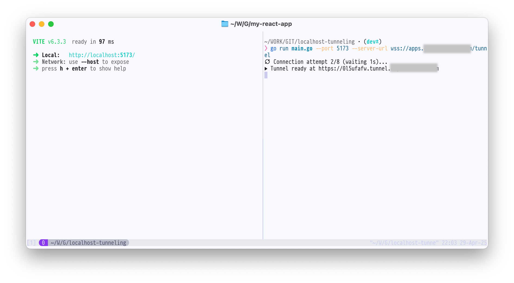
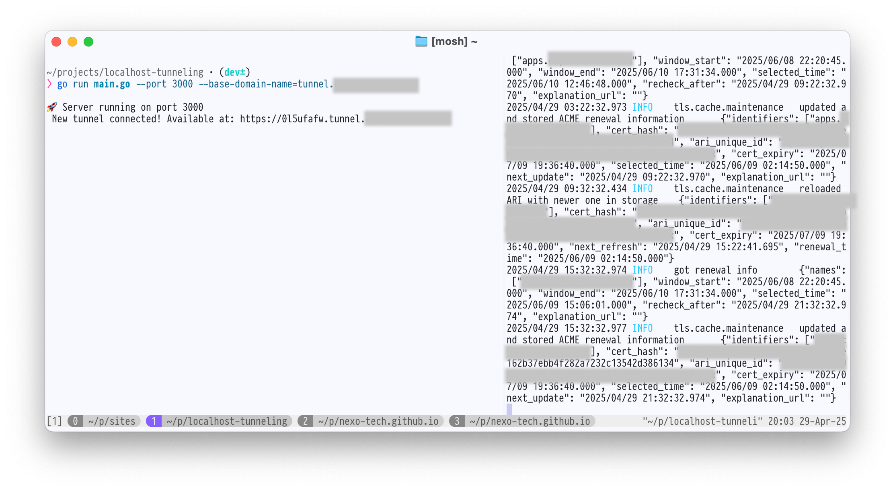
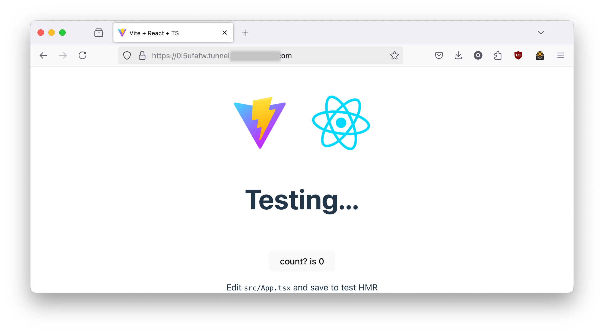
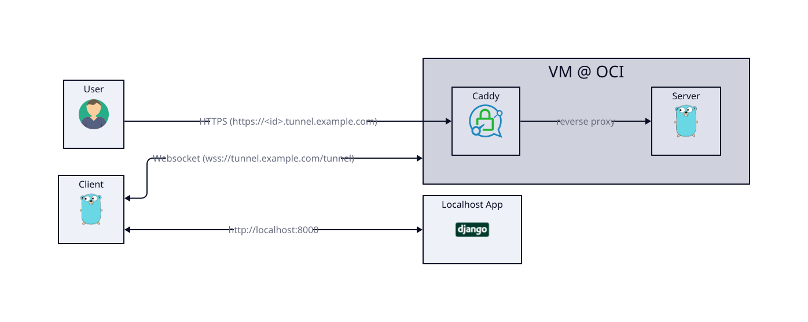

# microtunnel

Self-hosted HTTPS tunnels made simple — using Go, Caddy, and Cloudflare.

- One lightweight Go binary.
- Automatic HTTPS with wildcard certificates.
- WebSocket-based tunneling (no raw TCP needed).
- Fully self-hosted: your domain, your rules.

[Read the full story here →](https://nexo.sh/posts/building-your-own-https-tunnel/)

---

## Why microtunnel?

Tired of free tunnels timing out? Sick of complicated setups with closed-source tools? **microtunnel** lets you create your own HTTPS tunnels with minimal setup and full ownership.

- No paid plans
- No vendor lock-in
- No opaque black boxes

Just one Go binary + Caddy with automatic TLS = your own public HTTPS tunnel.

---

## Features

- 🔐 **Secure WebSocket-based tunneling**
- 🔒 **Automatic Let's Encrypt TLS** (via Cloudflare DNS)
- 📡 **Multiplexing** multiple HTTP streams over one WebSocket with [yamux](https://github.com/hashicorp/yamux)
- 🖊️ **Simple, structured logs** (thanks, Logrus)
- 🌐 **Designed for side-projects, demos, webhook testing**

---

## Quick Start

### Server Setup

First, prepare your environment variables:

```bash
export TUNNEL_SERVER_DOMAIN_NAME=tunnel.example.com
export CADDY_PROXY_PORT=3000
export CF_API_TOKEN=your_cloudflare_token
```

Build and run the server:

```bash
go run main.go --port 3000 --base-domain-name=tunnel.example.com
```

Caddy needs to be set up separately for wildcard HTTPS. See full guide in [the article](https://nexo.sh/posts/building-your-own-https-tunnel/).

---

### Client Usage

Tunnel your local app (e.g., running on localhost:8080):

```bash
go run main.go --server-url=wss://tunnel.example.com/tunnel --port 8080
```

You'll get a URL like:

```
https://ab12cd34.tunnel.example.com
```

Open it. Magic.

---

## How It Works

- **Clients** connect to `/tunnel` via secure WebSocket.
- Server assigns a **random 8-character subdomain**.
- **Caddy** handles automatic TLS certificates.
- **Yamux** multiplexes multiple HTTP requests over a single WebSocket.
- **HTTP hijacking** enables raw streaming of HTTP traffic without re-encoding.

For a deeper technical dive, check the full article.

---

## Requirements

- A domain (e.g., `example.com`) with Cloudflare managing DNS.
- A public VM (free Oracle/AWS/anything).
- Go (for building the binary).
- Caddy (with Cloudflare DNS plugin).

---

## Future Improvements

- Token-based tunnel authentication
- gRPC transport support
- Prometheus metrics for tunnel traffic

---

## Demo

### Tunnel established



### Incoming request to server



### Accessing local app via HTTPS



### Architecture



---

## License

MIT. Do whatever you want. Stars are appreciated if this saves you a billable hour. 😉

[GitHub Repository →](https://github.com/nexo-tech/microtunnel)
